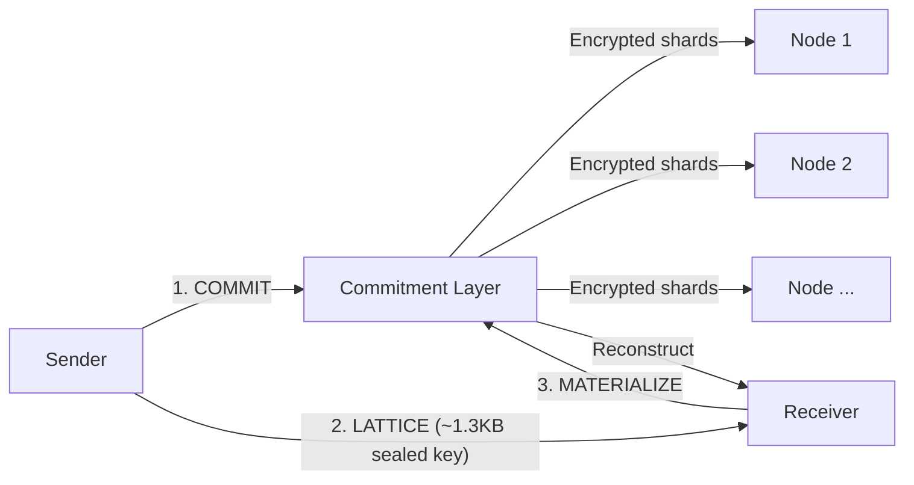
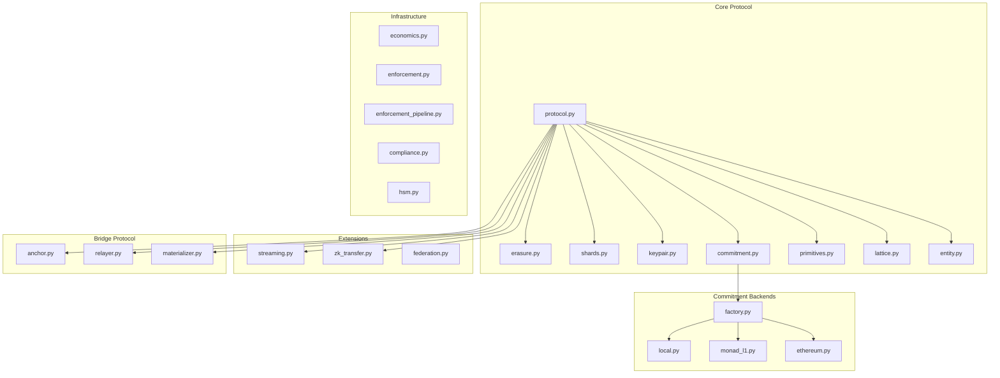
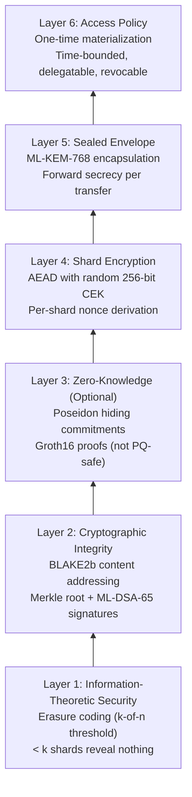

<div align="center">

# Entanglement Transfer Protocol

### A Post-Quantum Cryptographic Data Transfer Protocol

> *"Don't move the data. Transfer the proof. Reconstruct the truth."*

[]()
[]()
[]()
[]()
[]()

</div>

---

## The Problem

Every existing protocol -- TCP/IP, HTTP, FTP, QUIC -- operates on the same
foundational assumption: **data is a payload that must travel from Point A to
Point B.** This chains us to three unsolvable constraints:

1. **Latency** -- bound by the speed of light and routing hops
2. **Geography** -- further = slower, always
3. **Compute** -- larger payloads demand more processing at both ends

ETP rejects this assumption. Data transfer is not about moving bits. It is about
transferring the *ability to reconstruct* a deterministic output at a destination,
verified by an immutable commitment.

## Three-Phase Protocol



| Phase | Operation | What Happens |
|-------|-----------|-------------|
| **COMMIT** | Sender commits entity | Erasure encode, encrypt shards with random CEK, distribute to nodes, append to Merkle log |
| **LATTICE** | Sender seals key to receiver | ML-KEM-768 sealed envelope (~1.3KB) containing entity_id + CEK + commitment reference |
| **MATERIALIZE** | Receiver reconstructs entity | Unseal key, verify commitment, fetch k-of-n shards, decrypt, decode, verify integrity |

The entity is never serialized and shipped as a monolithic payload. It is
**committed, proved, and reconstructed**.

## Core Guarantees

| Property | Guarantee | Mechanism |
|----------|-----------|-----------|
| O(1) transfer path | Sender-to-receiver carries ~1.3KB regardless of entity size | ML-KEM sealed lattice key |
| Immutability | Committed entities cannot be altered | Append-only Merkle log with ML-DSA-65 signatures |
| Threshold secrecy | < k shards reveal nothing about the entity | Information-theoretic security via erasure coding |
| Non-repudiation | Sender cannot deny having committed an entity | ML-DSA-65 signatures on commitment records |
| Post-quantum security | Resistant to quantum computer attacks | ML-KEM-768 (FIPS 203) + ML-DSA-65 (FIPS 204) |
| Forward secrecy | Compromising one transfer doesn't compromise others | Fresh ML-KEM encapsulation per transfer |

## What's Implemented

| Capability | Status | Module |
|------------|--------|--------|
| Three-phase protocol (COMMIT/LATTICE/MATERIALIZE) | Done | `protocol.py` |
| Erasure coding (Reed-Solomon GF(256)) | Done | `erasure.py` |
| AEAD shard encryption (CEK per entity) | Done | `shards.py` |
| ML-KEM-768 sealed envelope | Done | `keypair.py` |
| ML-DSA-65 commitment signatures | Done | `primitives.py` |
| Append-only Merkle commitment log | Done | `commitment.py` |
| Pluggable backends (Local, Monad L1, Ethereum L2) | Done | `backends/` |
| Cross-chain bridge (L1Anchor, Relayer, L2Materializer) | Done | `bridge/` |
| Cross-deployment federation | Done | `federation.py` |
| Chunked streaming with backpressure | Done | `streaming.py` |
| ZK transfer mode (hiding commitments) | Done | `zk_transfer.py` |
| Economics engine (staking, slashing, rewards) | Done | `economics.py` |
| Enforcement pipeline (PDP, programmable slashing) | Done | `enforcement.py` |
| Compliance framework (9 control families) | Done | `compliance.py` |

## Architecture



## Security Stack



## Quick Start

```bash
# Clone and install
git clone https://github.com/0xSoftBoi/Entanglement-Transfer-Protocol.git
cd Entanglement-Transfer-Protocol
pip install -e ".[dev]"

# Run the demo
python -m ltp

# Run all tests
pytest tests/ -v
```

## Project Structure

```
Entanglement-Transfer-Protocol/
├── src/ltp/                    # Core protocol library
│   ├── protocol.py             # Three-phase COMMIT/LATTICE/MATERIALIZE
│   ├── primitives.py           # ML-KEM-768, ML-DSA-65, AEAD, hashing (PoC)
│   ├── commitment.py           # Merkle log, commitment network, node lifecycle
│   ├── erasure.py              # Reed-Solomon erasure coding over GF(256)
│   ├── shards.py               # AEAD shard encryption with CEK
│   ├── keypair.py              # ML-KEM sealed envelope (lattice key)
│   ├── lattice.py              # Lattice key construction
│   ├── entity.py               # Entity identity and shape analysis
│   ├── economics.py            # Staking, rewards, progressive slashing
│   ├── enforcement.py          # PDP proofs, programmable slashing, VDF audits
│   ├── enforcement_pipeline.py # Enforcement orchestration
│   ├── compliance.py           # 9-family compliance framework
│   ├── federation.py           # Cross-deployment discovery and trust
│   ├── streaming.py            # Chunked streaming with backpressure
│   ├── zk_transfer.py          # ZK hiding commitments (Poseidon + Groth16)
│   ├── hsm.py                  # HSM interface for key management
│   ├── backends/               # Pluggable commitment backends
│   │   ├── base.py             # Abstract CommitmentBackend interface
│   │   ├── local.py            # In-memory backend (PoC/tests)
│   │   ├── monad_l1.py         # Custom L1 simulation
│   │   ├── ethereum.py         # Ethereum L1/L2 simulation
│   │   └── factory.py          # Backend factory
│   └── bridge/                 # Cross-chain bridge protocol
│       ├── anchor.py           # L1 commitment (lock + attest)
│       ├── relayer.py          # Sealed key transport
│       └── materializer.py     # L2 verification + reconstruction
├── tests/                      # 821 tests across 19 files
├── docs/                       # Protocol documentation
│   ├── WHITEPAPER.md           # Full protocol specification
│   └── ...                     # See docs/README.md for index
├── pyproject.toml              # Package configuration
├── CHANGELOG.md                # Version history
├── CONTRIBUTING.md             # Contribution guidelines
├── SECURITY.md                 # Security policy
└── LICENSE                     # MIT License
```

## Documentation

See [docs/README.md](docs/README.md) for the full documentation index.

| Document | Description |
|----------|-------------|
| [Whitepaper](docs/WHITEPAPER.md) | Full protocol specification |
| [Architecture](docs/design-decisions/ARCHITECTURE.md) | System components and data flow |
| [Production Plan](docs/PRODUCTION_PLAN.md) | PoC to production roadmap |
| [Deployment Guide](docs/DEPLOYMENT_GUIDE.md) | Docker, Kubernetes, CI/CD |
| [Bridge MVP](docs/bridge-mvp-scope.md) | Cross-chain bridge scope |
| [Security Review](docs/design-decisions/Security/SECURITY_REVIEW-2-24-2026.md) | Formal security analysis |

## Test Suite

821 tests across 19 files. All core protocol tests pass with zero external dependencies.

| Category | Tests | Coverage |
|----------|-------|----------|
| Core protocol | `test_protocol.py`, `test_entity.py`, `test_primitives.py` | COMMIT/LATTICE/MATERIALIZE, entity identity, crypto primitives |
| Erasure coding | `test_erasure.py` | Encode/decode, edge cases, GF(256) arithmetic |
| Commitment layer | `test_commitment.py`, `test_merkle_log.py` | Merkle log, node lifecycle, audit protocol |
| Security theorems | `test_theorems.py`, `test_mainnet_security.py` | 7 formal theorems, configurable security levels |
| Bridge | `test_bridge.py` | End-to-end L1-L2 transfer, replay protection |
| Backends | `test_backends.py` | Local, Monad L1, Ethereum L2 backends |
| Economics | `test_economics.py` | Staking, slashing, rewards, correlation penalties |
| Enforcement | `test_enforcement.py`, `test_enforcement_pipeline.py` | PDP proofs, programmable slashing, invariants |
| Compliance | `test_compliance.py` | 9 control families, evidence collection |
| Federation | `test_federation.py` | Discovery, trust levels, cross-network resolution |
| Streaming | `test_streaming.py` | Chunked transfer, backpressure, manifest verification |
| ZK mode | `test_zk_transfer.py` | Hiding commitments, simulated proofs |
| Refinements | `test_refinements.py` | Performance optimizations, shard identification |
| Performance | `test_performance.py` | Benchmarks and scaling characteristics |

## Contributing

See [CONTRIBUTING.md](CONTRIBUTING.md) for development setup and guidelines.

## Security

See [SECURITY.md](SECURITY.md) for reporting vulnerabilities.

## License

MIT License. See [LICENSE](LICENSE).
