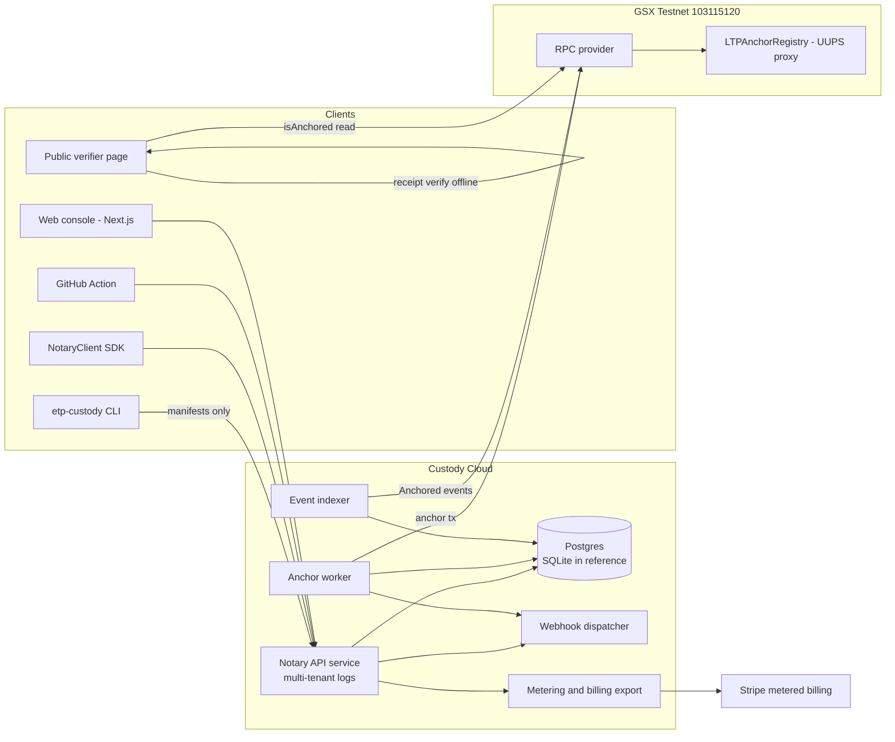

# ETP Custody Cloud — Production Design

The production application around `etp-custody`: a multi-tenant, zero-knowledge
notarization service with a web console, API, and **the deployed LTPAnchorRegistry
smart contract as one component** — an optional, paid trust amplifier that
anchors signed tree heads on-chain. Contracts are treated as audited, trusted
external components with documented interfaces (see `contracts/src/` and the v5
deployment in `CLAUDE.md`).

**Reference implementation shipped in this repo:** `src/ltp/cloud/` (store,
service, anchor worker — tested in `tests/test_cloud.py`). This document is the
full production design; the reference code implements its load-bearing core.

**Positioning guardrail** (from the strategy record): the chain is *one
component*, never the center. The free tier is fully verifiable offline with no
chain at all; anchoring is the "Verified" tier's independent timestamp
upper-bound. This follows `docs/usecases/COMPETITIVE_ANALYSIS.md` (anchoring is
the one place the chain stack earns its keep) and `docs/FREE_OPEN_PLAYBOOK.md`
(never gate verification; gate operations/compliance).

---

## 1. Product requirements & UX

**Personas**
- *Platform engineer* — notarizes build artifacts / documents via API or CI; wants a 5-minute integration and receipts that verify offline.
- *Compliance officer* — needs tamper-evident custody records, retention, exportable audit reports (21 CFR 11 / NERC-CIP shaped).
- *Auditor / relying party* — verifies receipts and anchors independently, without an account, without trusting our uptime.

**Functional requirements**
- Seal-locally / submit-manifest-only (zero-knowledge of content — structural, tested).
- Per-tenant append-only logs; portable receipts; in-toto attestations; offline verification; RFC-6962 consistency audits.
- API keys (hashed at rest, revocable); usage metering (billable unit = notarized capture).
- Optional on-chain anchoring of tenant STHs to LTPAnchorRegistry (GSX chain `103115120`), with full tx lifecycle visibility.
- Webhooks (`capture.notarized`, `anchor.confirmed`); email digests.
- Public verifier page: paste a receipt (or attestation) + drop the sealed file → PASS/FAIL, plus on-chain anchor check via RPC (read-only — **no wallet required to verify**).

**Non-functional targets (SLOs)**
- 99.9% API availability; p95 notarize < 250 ms (excluding client-side sealing).
- Receipts remain verifiable forever, independent of service availability.
- RPO ≤ 5 min (WAL shipping / Postgres PITR); RTO ≤ 1 h.
- Anchor confirmation within 2 anchor intervals (default interval 10 min).

**UX principles** — zero-ceremony first (`notarize file` and paste-to-verify),
progressive disclosure (anchoring/pinning appear when relevant), and honest
trust labeling (UNPINNED / operator-pinned / device-signed / ANCHORED badges,
matching the CLI's language).

## 2. System architecture



Data-flow invariants: plaintext and sealed blobs **never** cross the client
boundary; only manifests (hashes + signatures) do. The chain sees only 32-byte
digests/roots. Verification never *requires* the service or the chain.

## 3. Components

| Component | Reference impl | Production notes |
|---|---|---|
| Notary API | `cloud/service.py` (stdlib HTTP) | FastAPI/uvicorn behind a load balancer; same routes (§5) |
| Persistence | `cloud/store.py` (SQLite WAL) | Postgres; identical schema (§4); PITR backups |
| Anchor worker | `cloud/anchoring.py` | Scheduled (10 min default) or long-lived; KMS-held EOA signer |
| Event indexer | `cloud/indexer.py` — depth-final `Anchored` logs, persisted cursor; `reconcile()` safety net | Production LogSource wraps the web3 contract handle |
| Webhook dispatcher | `cloud/webhooks.py` — outbox + backoff + `X-ETP-Signature` HMAC | Same, on a scheduler |
| Metering | `usage()` counts captures | Nightly export → Stripe metered billing item |
| Console | designed (§6) | Next.js 14, deployed on the existing `website/` domain |
| Contracts | **already deployed** (v5) | Proxy `0xB29d…0bF4`, MultiSig→Timelock governance — unchanged |

## 4. Database schema

Reference (SQLite) shipped in `cloud/store.py`; Postgres DDL:

```sql
CREATE TABLE tenants (
  id           TEXT PRIMARY KEY,            -- t_<hex>
  name         TEXT NOT NULL,
  webhook_url  TEXT,
  plan         TEXT NOT NULL DEFAULT 'free',-- free | pro | verified (anchored)
  created_at   TIMESTAMPTZ NOT NULL DEFAULT now()
);
CREATE TABLE api_keys (
  key_hash     TEXT PRIMARY KEY,            -- SHA3-256(raw); raw shown once
  tenant_id    TEXT NOT NULL REFERENCES tenants(id),
  label        TEXT NOT NULL DEFAULT '',
  revoked      BOOLEAN NOT NULL DEFAULT FALSE,
  created_at   TIMESTAMPTZ NOT NULL DEFAULT now()
);
CREATE TABLE captures (                      -- manifests only: public data
  tenant_id    TEXT NOT NULL REFERENCES tenants(id),
  leaf_index   BIGINT NOT NULL,
  manifest     JSONB NOT NULL,
  created_at   TIMESTAMPTZ NOT NULL DEFAULT now(),
  PRIMARY KEY (tenant_id, leaf_index)
);
CREATE TABLE sths (
  tenant_id    TEXT NOT NULL REFERENCES tenants(id),
  sequence     BIGINT NOT NULL,
  sth          JSONB NOT NULL,
  created_at   TIMESTAMPTZ NOT NULL DEFAULT now(),
  PRIMARY KEY (tenant_id, sequence)
);
CREATE TABLE anchors (                       -- on-chain tx lifecycle
  id           BIGSERIAL PRIMARY KEY,
  tenant_id    TEXT NOT NULL REFERENCES tenants(id),
  sth_sequence BIGINT NOT NULL,
  root         TEXT NOT NULL,                -- b64 Merkle root
  digest       TEXT NOT NULL,                -- b64 anchor digest (chain key)
  status       TEXT NOT NULL CHECK (status IN ('pending','submitted','confirmed','failed')),
  tx_ref       TEXT, attempts INT NOT NULL DEFAULT 0, error TEXT,
  block_number BIGINT,                       -- set by indexer on confirm
  created_at   TIMESTAMPTZ NOT NULL DEFAULT now(),
  updated_at   TIMESTAMPTZ NOT NULL DEFAULT now(),
  UNIQUE (tenant_id, sth_sequence)
);
CREATE TABLE webhook_outbox (
  id BIGSERIAL PRIMARY KEY, tenant_id TEXT NOT NULL, event JSONB NOT NULL,
  attempts INT NOT NULL DEFAULT 0, delivered_at TIMESTAMPTZ,
  next_attempt_at TIMESTAMPTZ NOT NULL DEFAULT now()
);
CREATE TABLE indexer_cursor (chain_id BIGINT PRIMARY KEY, last_block BIGINT NOT NULL);
-- Console users (OAuth) — tenant membership
CREATE TABLE users (id UUID PRIMARY KEY, email TEXT UNIQUE NOT NULL, created_at TIMESTAMPTZ DEFAULT now());
CREATE TABLE memberships (user_id UUID REFERENCES users(id), tenant_id TEXT REFERENCES tenants(id),
  role TEXT NOT NULL CHECK (role IN ('owner','admin','member','auditor')), PRIMARY KEY (user_id, tenant_id));
```

Notes: usage is *derived* (`COUNT(captures)`) — no drift-prone counter table.
Keys are hashed at rest. No plaintext/sealed columns exist anywhere, by design.

## 5. API specification

Full OpenAPI 3.1: [`docs/cloud/openapi.yaml`](openapi.yaml). Summary:

| Method & path | Auth | Purpose |
|---|---|---|
| `GET /healthz` | — | liveness + totals |
| `GET /v1/operator` | — | operator vk to pin |
| `POST /v1/captures` | API key | notarize a manifest → receipt (metered) |
| `GET /v1/sth` · `GET /v1/proof/{i}` | API key | latest STH · inclusion proof |
| `GET /v1/usage` | API key | billable capture count |
| `GET /v1/anchors` | API key | anchor rows w/ lifecycle status + tx ref |
| `POST /v1/admin/tenants` | admin token | create tenant + first key |
| `POST /v1/keys` · `DELETE /v1/keys/{hash}` | console session | key management |
| `GET /v1/t/{tenant}/sth` · `/proof/{i}` | — (public, prod) | third-party monitoring/audit |

Conventions: bearer keys (`etpk_…`), JSON errors `{"error": …}`, 401/400/404
semantics as implemented, idempotent POSTs keyed on `capture_id` (prod),
rate limits per key (prod).

## 6. Frontend (console)

Next.js 14 (App Router), Tailwind with the landing page's design tokens
(`website/index.html` dark theme), TypeScript.

**Pages**
- `/dashboard` — captures over time, anchor status strip, usage vs plan.
- `/notarize` — drag-and-drop; **sealing happens in-browser** (WASM build of the seal path; the file never uploads), manifest submitted, receipt + attestation downloaded.
- `/captures` — filterable table (originator, date, device-signed badge) → detail drawer: manifest fields, proof path, receipt/attestation downloads.
- `/anchors` — timeline of STH anchors: status chips (pending/submitted/confirmed/failed), tx ref → GSX explorer link, "anchor now" (Verified plan).
- `/audit` — pick any two receipts → consistency check (append-only proof), fork alarm.
- `/keys` — issue/label/revoke API keys (shown once), per-key usage.
- `/settings` — webhook URL + signing secret, plan, data export.
- `/verify` (public, no auth) — paste receipt/attestation + drop sealed file → offline verification in-browser + optional `isAnchored` RPC read with an "ANCHORED at block N" badge.

**Wallet integration** — wagmi + viem + RainbowKit, *scoped deliberately small*:
reads (`isAnchored`, `Anchored` events) need no wallet; an optional "co-anchor
from my own address" on `/verify` lets a relying party pay to anchor a digest
themselves (connect wallet → `anchor(...)` tx → toast with lifecycle). The
service's own anchoring uses a server-side KMS signer, never a browser wallet.

## 7. Backend services

- **notary-api** — stateless; per-tenant logs cached in memory, rebuilt from DB on cold start (reference behavior, kept in prod; O(tenant log) once per boot).
- **anchor-worker** — `run_once()` on a scheduler; stages: enqueue (idempotent per (tenant, sth)), submit (via `AnchorClient` with its circuit breaker + token-bucket rate limiter), reconcile.
- **indexer** — tails `Anchored`/`BatchAnchored` logs from the proxy, advances `indexer_cursor`, sets `block_number`, flips `submitted → confirmed`; the poll-based `reconcile()` stays as a safety net.
- **webhook-dispatcher** — outbox rows, exponential backoff, `X-ETP-Signature` HMAC.
- **metering/billing** — nightly usage export to Stripe metered items (connector auth pending — stubbed).

## 8. Smart-contract interaction layer

**Interface used** (from `contracts/src/interfaces/ILTPAnchorRegistry.sol`,
deployed v5 proxy `0xB29d8BFF4973D1D7bcB10E32112EBB8fdd530bF4`):

```solidity
function anchor(bytes32 anchorDigest, bytes32 entityIdHash, bytes32 merkleRoot,
                bytes32 policyHash, bytes32 signerVkHash,
                uint64 sequence, uint64 validUntil, uint8 receiptType) external;
function batchAnchor(bytes32[] …) external;              // ≤ MAX_BATCH_SIZE
event Anchored(bytes32 indexed anchorDigest, …);
event BatchAnchored(…);
// reads: isAnchored(bytes32), entityState(bytes32), signerSequence(bytes32)
```

**Field mapping** (implemented in `AnchorWorker._submission`):
`anchorDigest = SHA3-256("GSX-LTP:custody-anchor:v1" ‖ tenant ‖ seq ‖ root)`
(unique, deterministic, tenant-scoped); `merkleRoot = STH root`;
`signerVkHash = SHA3-256(operator vk)`; `sequence = STH sequence`;
`policyHash = SHA3-256("GSX-LTP:custody-sth-policy:v1")`; `receiptType = "custody-sth"`.

**Transaction lifecycle** — persisted state machine (tested):
`pending → submitted (tx_ref) → confirmed`, with attempt-counted retries and
`failed` after `max_attempts`; every stage idempotent so the worker can crash
and rerun. The Python `AnchorClient` supplies nonce management, a circuit
breaker, and a 10-tx/min token bucket; `ANCHOR_TX_TIMEOUT` bounds receipt polls.

**Event indexing & reorgs** — index `Anchored` logs with N-block confirmation
depth before flipping to `confirmed`; on reorg (log removed), revert the row to
`submitted` and let reconcile re-check. GSX finality is fast; depth is config.

**Keys & gas** — the anchoring EOA is KMS-held (never in env in prod), funded
and alert-monitored; per-day gas budget caps the worker. Batch optimization:
many tenants' digests per `batchAnchor` call (roadmap M2).

**What an anchor proves** (stated honestly, per the provenance brief): an upper
time-bound and non-rewrite for the anchored root — not the semantic truth of a
tenant's hashes. Receipts carry the cryptographic proof; the chain adds an
independent, publicly checkable timestamp.

## 9. State management

- **Frontend:** TanStack Query for all server state (receipts, captures, anchors — polling anchors while `pending|submitted`); wagmi/viem for chain state (`isAnchored`, tx sends on `/verify`); Zustand only for ephemeral UI (drawers, upload progress); zero client-side duplication of server truth.
- **Backend:** the append-only log **is** the state; in-memory `ProvenanceLog` per tenant is a cache over `captures`/`sths` rows (write-through, rebuild-on-boot — restart-tested). Anchor rows are a persisted state machine (§8). No other mutable state.

## 10. User flows

1. **Onboard:** OAuth sign-in → create workspace (tenant) → API key shown once → copy CLI/SDK/Action snippet → first capture appears on dashboard live.
2. **Notarize (API/CI):** client seals locally → `POST /v1/captures` (manifest) → 201 receipt → webhook `capture.notarized` → attestation uploaded as CI artifact (existing GitHub Action).
3. **Verify (third party):** open `/verify` (no account) → paste receipt + drop sealed file → offline PASS/FAIL with pinning explained → optional chain check shows "ANCHORED, block N, tx ↗".
4. **Anchor lifecycle:** Verified-plan tenant sees each STH progress pending → submitted (tx link) → confirmed (block); failures surface with error + retry-by state; `anchor.confirmed` webhook fires.
5. **Audit:** auditor uploads two receipts → consistency proof result ("append-only extension" / "same checkpoint" / **fork alarm**).
6. **Key rotation / revoke:** new key issued, old revoked → 401s immediately (hash lookup), audit-logged.

## 11. Infrastructure & deployment

- **Packaging:** one container (`Dockerfile`, shipped) runs api / worker / indexer by role flag; reference `python -m ltp.cloud.service` behind Caddy for TLS.
- **Environments:** dev (SQLite, FakeAnchorClient) → staging (Postgres, GSX Testnet) → prod (Postgres HA, GSX; later mainnet per contract roadmap).
- **Config/secrets:** 12-factor env (`ETP_CLOUD_DB`, `ETP_CLOUD_ADMIN_TOKEN`, `GSX_RPC_URL`); anchoring key + operator signing key in KMS/HSM (reference stores operator key in DB `service_config` — explicitly a reference-only shortcut).
- **Data:** Postgres with PITR; the append-only tables make backups trivially consistent; receipts held by clients mean even total DB loss doesn't invalidate issued proofs.
- **Rollout:** blue/green for the API (stateless); the worker is single-flight (advisory lock) to avoid duplicate submissions (DB uniqueness backstops it anyway).

## 12. CI/CD, monitoring, scalability, testing, roadmap

**CI/CD** — GitHub Actions (`.github/workflows/ci.yml`, shipped): lint-lite +
full pytest with real PQC on 3.10–3.12; container build on tags; staging deploy
on main, prod deploy on release tag with manual approval; contract addresses are
config, never redeployed by app CI.

**Monitoring** — OTel traces on API + worker; Prometheus metrics
(`captures_total{tenant}`, `anchor_lifecycle_seconds`, `webhook_failures`,
`rpc_errors`, wallet balance gauge); Sentry for exceptions; alerts: anchor stuck
in `submitted` > 2 intervals, breaker open, signer balance low, webhook outbox
aging.

**Scalability** — logs are per-tenant, so tenants shard horizontally by
`tenant_id`; hot-tenant ceiling → tile-based log storage (tessera-style) per the
prior-art build-on list; anchoring cost is already O(1)/tenant/interval and
batches further via `batchAnchor`; read path (proofs/STHs) is cache-friendly and
CDN-able; the in-memory-log-rebuild boot cost is bounded per tenant and
lazy-loaded.

**Testing strategy** — implemented tiers: unit (store, digests), integration
(HTTP roundtrip via SDK, restart durability, tenant isolation, webhook
delivery), contract-layer (lifecycle vs. a faithful `AnchorClient` double);
production adds: fork tests against a GSX fork with the real deployed proxy
(reusing `contracts/test/` + `cast`), console e2e (Playwright — bundled Chromium
already used for the site), load (k6: notarize p95, worker backlog drain), and
chaos on the worker (kill mid-submit → idempotent recovery, already unit-proven).

**Roadmap** — **M0 (done, this repo):** durable multi-tenant service, anchor
lifecycle, webhooks, metering, CI, container. **M1:** Postgres + FastAPI port,
outbox dispatcher, event indexer with reorg depth, console MVP (dashboard,
captures, keys, verify). **M2:** Stripe metered billing, `batchAnchor`
aggregation, public per-tenant monitor endpoints, SSO/RBAC (paid). **M3:**
compliance report packs (21 CFR 11 / NERC-CIP), witness cosigning, HSM operator
keys, in-browser WASM sealing. **M4:** mainnet anchoring option, air-gapped
on-prem distribution (the gov/regulated tier).
