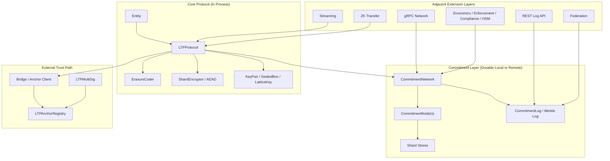

# Entanglement Transfer Protocol Architecture Breakdown

## Summary

This document maps the implementation that exists in this repository today. It is intentionally grounded in code and observed test behavior, not in README positioning.

The system has one clear center of gravity:

1. `COMMIT`: entity content is erasure-coded, shard-encrypted, distributed to commitment nodes, and bound into a signed commitment record.
2. `LATTICE`: the sender creates a sealed envelope carrying the minimum receiver material: entity reference, CEK, and commitment reference.
3. `MATERIALIZE`: the receiver unseals, fetches enough encrypted shards, decrypts, reconstructs, and verifies the entity.

Everything else in the repo extends, transports, anchors, audits, or models governance around that flow.

## Architecture Truths

- The core protocol path is more concrete than the surrounding platform layers.
- Several important modules are explicitly PoC-grade, simulated, or dependent on external infra that is not present by default.
- The repo contains both real durable boundaries and many in-process control-plane models; those should not be conflated.
- Some transport and governance guarantees are external deployment assumptions rather than properties enforced entirely by code.
- README maturity language is more aggressive than the implementation in several areas, especially crypto mode, backend realism, HSM posture, and some extension layers.

## System Diagram

## Data Flow

### COMMIT

Flow:
- `Entity` content enters `LTPProtocol.commit(...)`
- `ErasureCoder` splits content into `n` shards with reconstruction threshold `k`
- `ShardEncryptor` generates a per-entity CEK and encrypts each shard
- `CommitmentNetwork.distribute_encrypted_shards(...)` places ciphertext on commitment nodes
- `CommitmentRecord` is signed and appended to `CommitmentLog`

Durable outputs:
- encrypted shard data in shard stores
- commitment record and Merkle-log state

Trust boundary:
- nodes should only receive ciphertext, never the CEK
- integrity depends on the signed record plus append-only log semantics

### LATTICE

Flow:
- sender constructs `LatticeKey` with `entity_id`, CEK, commitment reference, and policy
- `SealedBox` encrypts the payload to the receiver’s ML-KEM public key

Durable outputs:
- none required by the base protocol; the sealed artifact is a transferable payload

Trust boundary:
- confidentiality shifts to receiver key custody and the correctness of encapsulation/decapsulation behavior

### MATERIALIZE

Flow:
- receiver unseals the lattice payload
- receiver locates the commitment record and fetches enough encrypted shards
- receiver decrypts shards, reconstructs content, and verifies entity identity

Durable outputs:
- optional receiver-side persistence only; the protocol itself reconstructs in process

Trust boundary:
- correctness depends on authentic commitment data, sufficient shard availability, and valid decryption/reconstruction

## Persistence Model

### Local In-Process State

Examples:
- protocol sessions and key registries
- federation trust registry
- streaming state
- economics/enforcement counters and snapshots
- simulated chain state in some backends

Operational meaning:
- useful for modeling and local execution
- not a durable trust anchor by itself

### Local Durable State

Examples:
- filesystem or sqlite shard stores
- commitment log persisted through local storage layers

Operational meaning:
- durable on a single node or machine
- trust depends on local operator controls

### Network-Exposed State

Examples:
- gRPC node operations
- REST commitment-log endpoints

Operational meaning:
- the data plane is exposed beyond pure in-process execution
- transport security and access control are not fully intrinsic to the current implementation

### On-Chain Durable State

Examples:
- anchor digests
- entity states
- signer authorization
- signer sequence high-water marks

Operational meaning:
- the strongest durable boundary in the repo when actually connected to a deployed contract
- only available when the anchor path is configured and external infra exists

## Subsystem Map

Each subsystem below uses the same template:

- `Maturity`
- `Purpose`
- `Main entrypoints / key types`
- `Dependencies`
- `Stateful components / persistence boundary`
- `Trust boundary / assumptions`

## Core Protocol

### `protocol`

- `Maturity`: implemented
- `Purpose`: orchestrates COMMIT, LATTICE, and MATERIALIZE around the core protocol invariants.
- `Main entrypoints / key types`: `LTPProtocol`, `TransferSession`, `TransferState`, `ProtocolConfig`
- `Dependencies`: `entity`, `erasure`, `shards`, `commitment`, `keypair`, `lattice`, `primitives`
- `Stateful components / persistence boundary`: in-memory transfer sessions, entity-size bookkeeping, committed-entity tracking
- `Trust boundary / assumptions`: assumes sender key validity, shard availability above threshold, and consistent crypto/backend behavior

### `primitives`

- `Maturity`: implemented with simulation fallback
- `Purpose`: provides hashing, AEAD, ML-KEM, ML-DSA, and security-profile selection
- `Main entrypoints / key types`: `AEAD`, `MLKEM`, `MLDSA`, `SecurityProfile`, `canonical_hash`, `internal_hash`
- `Dependencies`: optional `pqcrypto` and `pynacl` backends, dual-lane hashing
- `Stateful components / persistence boundary`: module-level active profile and crypto-provider selection
- `Trust boundary / assumptions`: actual cryptographic assurance depends on installed backends; fallback PoC behavior exists

### `commitment`

- `Maturity`: implemented
- `Purpose`: provides ciphertext shard storage, commitment records, append-only log behavior, node auditing, and node reputation/economics scaffolding
- `Main entrypoints / key types`: `CommitmentNode`, `CommitmentNetwork`, `CommitmentRecord`, `CommitmentLog`, `AuditResult`, `StakeEscrow`
- `Dependencies`: `storage`, hashing/signing primitives, Merkle-log utilities
- `Stateful components / persistence boundary`: shard stores, node state, log chain, audit/reputation state
- `Trust boundary / assumptions`: assumes nodes hold ciphertext only, log append semantics are preserved, and node economics are meaningful only when operators are externalized

### `erasure`

- `Maturity`: implemented
- `Purpose`: encodes content into k-of-n recoverable shards and reconstructs from any sufficient subset
- `Main entrypoints / key types`: `ErasureCoder`
- `Dependencies`: internal GF(256) math only
- `Stateful components / persistence boundary`: stateless transform layer
- `Trust boundary / assumptions`: callers preserve parameter integrity and do not mix shards from different entities or encoding sets

### `shards`

- `Maturity`: implemented
- `Purpose`: encrypts and decrypts shards under a per-entity CEK with per-shard nonce derivation
- `Main entrypoints / key types`: `ShardEncryptor`
- `Dependencies`: `AEAD`, hashing
- `Stateful components / persistence boundary`: no durable internal state beyond generated CEKs at call time
- `Trust boundary / assumptions`: requires CEK uniqueness and nonce-derivation correctness

### `keypair`

- `Maturity`: implemented with mixed custody posture
- `Purpose`: manages combined ML-KEM/ML-DSA keypairs, sealing, and rotation helpers
- `Main entrypoints / key types`: `KeyPair`, `SealedBox`, `KeyRegistry`, `KeyRotationManager`
- `Dependencies`: `primitives`
- `Stateful components / persistence boundary`: in-memory key objects and registries
- `Trust boundary / assumptions`: private keys live directly in Python objects unless external handling is added; HSM integration is modeled but not fully enforced as a hard boundary

### `lattice`

- `Maturity`: implemented
- `Purpose`: constructs the minimal sealed transfer payload for receiver reconstruction
- `Main entrypoints / key types`: `LatticeKey`
- `Dependencies`: `SealedBox`, serialization helpers, hashing
- `Stateful components / persistence boundary`: stateless payload construction
- `Trust boundary / assumptions`: commitment reference and CEK binding are assumed sufficient to re-enter the commitment layer safely

### `entity`

- `Maturity`: implemented
- `Purpose`: defines logical entity identity and shape metadata
- `Main entrypoints / key types`: `Entity`
- `Dependencies`: hashing
- `Stateful components / persistence boundary`: dataclass state only
- `Trust boundary / assumptions`: entity ID semantics depend on content, shape, sender key material, and timestamp inputs being stable and intentionally chosen

## Infrastructure

### `storage`

- `Maturity`: implemented
- `Purpose`: abstracts shard persistence behind memory, filesystem, and sqlite stores
- `Main entrypoints / key types`: `ShardStore`, `MemoryShardStore`, `FilesystemShardStore`, `SQLiteShardStore`
- `Dependencies`: local persistence libraries only
- `Stateful components / persistence boundary`: local machine persistence or in-memory ephemeral storage
- `Trust boundary / assumptions`: stores are persistence mechanisms, not authenticated storage protocols

### `network`

- `Maturity`: implemented, development-oriented transport
- `Purpose`: exposes commitment-node shard operations over gRPC and remote-node wrappers
- `Main entrypoints / key types`: `NodeServer`, `NodeClient`, `RemoteNode`
- `Dependencies`: `grpc`, `CommitmentNode`
- `Stateful components / persistence boundary`: bound sockets, remote shard operations, connection lifecycle
- `Trust boundary / assumptions`: current implementation assumes trusted deployment context; transport auth and encryption are not first-class invariants

### `rest_server`

- `Maturity`: implemented, external-infra-dependent for secure deployment
- `Purpose`: exposes the commitment log as an RFC 6962-style HTTP API
- `Main entrypoints / key types`: `CommitmentLogRestServer`
- `Dependencies`: stdlib `HTTPServer`, commitment-log types
- `Stateful components / persistence boundary`: network-facing access to the commitment log
- `Trust boundary / assumptions`: assumes deployment will add TLS, auth, and operational hardening if exposed beyond local or lab usage

### `anchor`

- `Maturity`: implemented, external-infra-dependent
- `Purpose`: connects Python anchor submission, query, and state handling to the Solidity registry
- `Main entrypoints / key types`: `AnchorClient`, `AnchorSubmission`, `EntityState`
- `Dependencies`: `web3`, contract ABI compatibility, deployed chain access
- `Stateful components / persistence boundary`: on-chain state is external and durable; Python client state is ephemeral
- `Trust boundary / assumptions`: actual anchoring guarantees only exist when a live contract deployment and operator credentials are configured

### `backends`

- `Maturity`: mixed; local backend implemented, Ethereum/Monad paths partly simulated
- `Purpose`: abstracts where commitment and registry semantics are realized
- `Main entrypoints / key types`: `CommitmentBackend`, `BackendConfig`, `LocalBackend`, `EthereumBackend`, `MonadL1Backend`
- `Dependencies`: hashing, economics, optional anchor client
- `Stateful components / persistence boundary`: local in-process simulated chain state or optional live RPC-backed contract state
- `Trust boundary / assumptions`: backend names do not guarantee equal assurance; simulation mode and anchored mode are materially different architectures

## Extensions

### `bridge`

- `Maturity`: implemented with simulation-heavy coordination
- `Purpose`: adds cross-deployment commit, relay, and materialization flow on top of the core protocol
- `Main entrypoints / key types`: `L1Anchor`, `Relayer`, `L2Materializer`, `BridgeMessage`, `BridgeCommitment`
- `Dependencies`: `protocol`, `anchor`, `sequencing`, `receipt`, `envelope`
- `Stateful components / persistence boundary`: local relay/materialization state, message sequencing, optional on-chain anchor linkage
- `Trust boundary / assumptions`: relies on off-chain coordination and message movement around the durable anchor path; some “chain” behavior is modeled locally

### `federation`

- `Maturity`: experimental
- `Purpose`: models trust establishment and entity resolution across independently bootstrapped LTP networks
- `Main entrypoints / key types`: `FederationRegistry`, `FederatedNetwork`, `EntityResolution`, `TrustLevel`
- `Dependencies`: hashing and local trust-state logic
- `Stateful components / persistence boundary`: in-memory registry and resolution cache
- `Trust boundary / assumptions`: remote trust is represented conceptually, but much of the verification flow is still modeled rather than fully network-hardened

### `streaming`

- `Maturity`: experimental
- `Purpose`: models chunked commit and incremental materialization for large or real-time entities
- `Main entrypoints / key types`: `EntityStream`, `StreamConfig`, `StreamChunk`, `StreamManifest`
- `Dependencies`: hashing, protocol-adjacent lifecycle logic
- `Stateful components / persistence boundary`: in-memory stream metadata and chunk ordering state
- `Trust boundary / assumptions`: streaming coordinates many mini-commitments, but persistence and receiver-consumption guarantees are still local-model oriented

### `zk_transfer`

- `Maturity`: experimental
- `Purpose`: adds hidden-commitment and proof-based privacy modes alongside the base transfer flow
- `Main entrypoints / key types`: `ZKTransferMode`, `ZKConfig`, `ZKCommitment`, `ZKProof`
- `Dependencies`: hashing; real proof systems are not fully present in current code
- `Stateful components / persistence boundary`: local proof and commitment objects
- `Trust boundary / assumptions`: includes simulated proof behavior and a non-PQ-safe Groth16 mode; not equivalent to the baseline PQ transfer path

### `economics`

- `Maturity`: implemented as local economics engine and policy model
- `Purpose`: models staking, slashing, epoch accounting, and reward logic for node operators
- `Main entrypoints / key types`: economics engine and node/staking data models
- `Dependencies`: backend and commitment-layer integration points
- `Stateful components / persistence boundary`: in-memory economic state, snapshots, pending slashes
- `Trust boundary / assumptions`: strong only when tied to real operator identity, asset custody, and enforceable slashing paths

### `enforcement`

- `Maturity`: implemented as policy and evidence framework
- `Purpose`: models enforcement decisions, PDP evidence, slashing inputs, and related trust-layer controls
- `Main entrypoints / key types`: enforcement data structures and verification helpers
- `Dependencies`: commitment layer, receipts, economics
- `Stateful components / persistence boundary`: local evidence and policy evaluation state
- `Trust boundary / assumptions`: enforcement requires authentic evidence and an actual penalty path outside pure in-process modeling

### `compliance`

- `Maturity`: external-infra-dependent
- `Purpose`: models regulated-environment controls, crypto-provider selection, and audit/compliance posture
- `Main entrypoints / key types`: compliance configuration and crypto-provider abstractions
- `Dependencies`: `primitives`, optional HSM and crypto backends
- `Stateful components / persistence boundary`: provider configuration and local evidence structures
- `Trust boundary / assumptions`: compliance posture depends on concrete backend selection and deployment controls, not on this module alone

### `hsm`

- `Maturity`: external-infra-dependent with PoC software implementation
- `Purpose`: defines an HSM interface for isolated key operations and provides an in-memory `SoftwareHSM`
- `Main entrypoints / key types`: `HSMBackend`, `SoftwareHSM`
- `Dependencies`: `primitives`, security-profile selection
- `Stateful components / persistence boundary`: in-memory private key store in the software implementation
- `Trust boundary / assumptions`: real hardware isolation does not exist unless an actual HSM backend is implemented and correctly wired through callers

## Solidity / Governance

### `contracts/src/LTPAnchorRegistry.sol`

- `Maturity`: implemented, external-infra-dependent
- `Purpose`: on-chain registry for anchor digests, entity state transitions, signer authorization, pause control, and per-signer sequencing
- `Main entrypoints / key types`: `anchor`, `batchAnchor`, `transitionState`, `registerSigner`, `revokeSigner`, `initialize`
- `Dependencies`: OpenZeppelin `Initializable`, `UUPSUpgradeable`, `ILTPAnchorRegistry`
- `Stateful components / persistence boundary`: durable on-chain storage for anchor records, entity state, authorized signers, and signer sequences
- `Trust boundary / assumptions`: strongest durable trust anchor in the repo when deployed, but upgrade/admin safety depends on deployment governance around `admin`

### `contracts/src/LTPMultiSig.sol`

- `Maturity`: implemented, testnet-oriented
- `Purpose`: lightweight N-of-M admin wallet for governing registry actions
- `Main entrypoints / key types`: `submitTransaction`, `confirmTransaction`, `executeTransaction`, owner-management and threshold-management functions
- `Dependencies`: Solidity runtime only
- `Stateful components / persistence boundary`: durable on-chain owner set, threshold, queued transactions, and confirmations
- `Trust boundary / assumptions`: explicitly described in code as lightweight and testnet-oriented; production governance is expected to use stronger external tooling such as Gnosis Safe

## Public Interfaces That Define System Shape

The main behavioral interfaces an implementer or reviewer should treat as canonical are:

- `LTPProtocol` for COMMIT/LATTICE/MATERIALIZE orchestration
- `CommitmentNetwork`, `CommitmentNode`, and `CommitmentRecord` for the commitment layer
- `KeyPair`, `SealedBox`, and `LatticeKey` for transfer-key custody and receiver handoff
- `CommitmentBackend` and `AnchorClient` for backend and anchoring integration
- `LTPAnchorRegistry` and `LTPMultiSig` for the durable governance and anchoring boundary

These interfaces define the architecture more than any README table does.

## Coverage Reality

Observed from this environment:

- `tests/test_protocol.py` and `tests/test_bridge.py` passed
- `tests/test_network.py` currently fails at startup because the fixture constructs `NodeServer(..., port=0, host="localhost")` and the bind path fails before the real round-trip assertions run
- `tests/test_contract_integration.py` exists, but all tests were skipped here because its external prerequisites were not active

Architecture implication:

- the core protocol and bridge flows have direct local evidence
- the network and on-chain integration layers should be treated as less validated in a default environment

## What This Means For Later Review

The most important framing for later audit and backlog work is:

- treat the core protocol as the implementation baseline
- treat transport, federation, ZK, HSM, and some backend/governance claims as separate assurance questions
- distinguish carefully between code that enforces a trust boundary and code that merely models one
